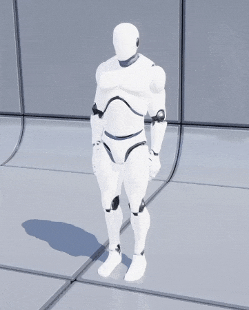

---
layout:
  title:
    visible: true
  description:
    visible: true
  tableOfContents:
    visible: true
  outline:
    visible: true
  pagination:
    visible: true
---

# 👋 Welcome

game lover. **game developer**.

&#x20;

<figure><figcaption></figcaption></figure>

## Who am I?

I'm Christopher, a Software Engineer in the games industry.

I'm primarily interested in how mainstream software methodologies can be applied to the games inudstry pipeline to help improve the developer experience, reduce code complexity, lower development costs, and reduce crunch.

I am a big proponent for clean and simple code that gets the job done while still fully meeting business needs. I am also an advocate for the use of good software practices such as entity-component systems (I built my own [nucleus-ecs.md](personal/nucleus-ecs.md "mention")!), automated testing using behaviour-driven development, and the usage of design patterns to simplify common problems.

## My Socials

<table data-view="cards"><thead><tr><th></th><th></th><th></th><th data-hidden data-card-cover data-type="files"></th><th data-hidden data-card-target data-type="content-ref"></th></tr></thead><tbody><tr><td><strong>CV</strong></td><td>View my Curriculum vitae.</td><td></td><td><a href=".gitbook/assets/cv_small (1).png">cv_small (1).png</a></td><td></td></tr><tr><td>G<strong>itHub</strong></td><td>View projects I have created and contributed to.</td><td></td><td><a href=".gitbook/assets/github.png">github.png</a></td><td><a href="https://github.com/christopher-buss">https://github.com/christopher-buss</a></td></tr><tr><td><strong>LinkedIn</strong></td><td>Connect with me on LinkedIn.</td><td></td><td><a href=".gitbook/assets/LinkedIN.png">LinkedIN.png</a></td><td></td></tr></tbody></table>

***
