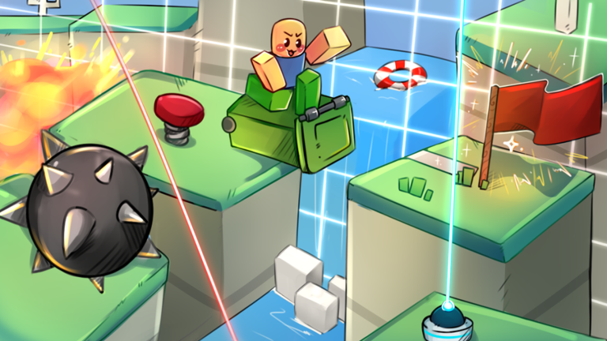

# 🎈 Pranksters - Aether Interactive

<figure><figcaption></figcaption></figure>


Pranksters Game Page


As a gameplay programmer at Aether Interactive, I was apart of a small team creating experiences on the roblox platform.

***

### Key Skills

TypeScript, React, Luau, ESLint

As a Guest User

As an Editor

As an Admin

